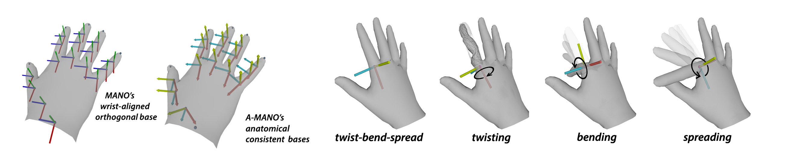
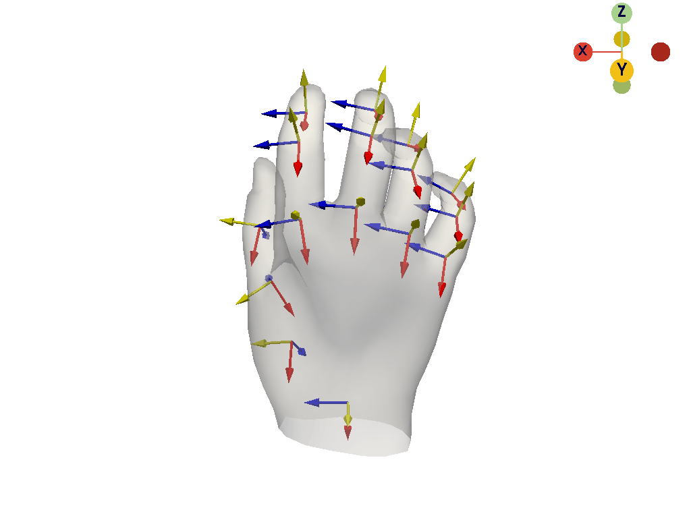
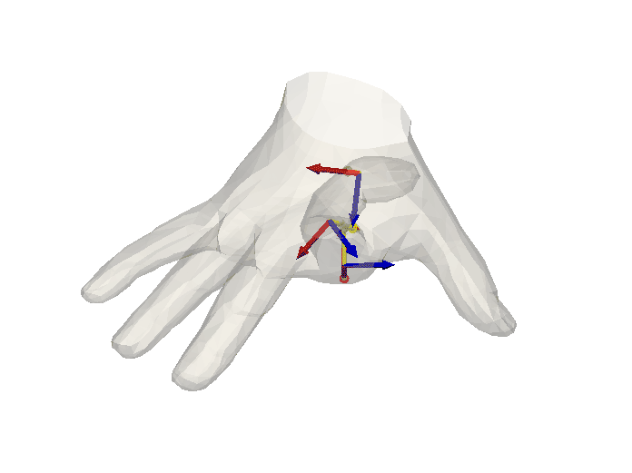
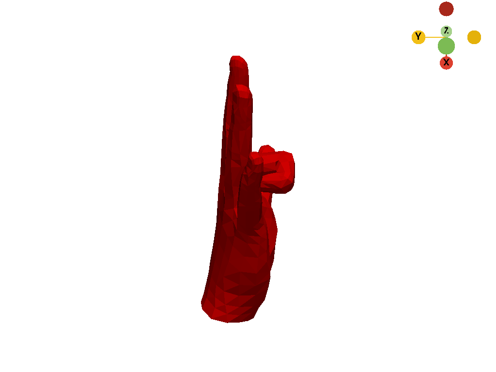
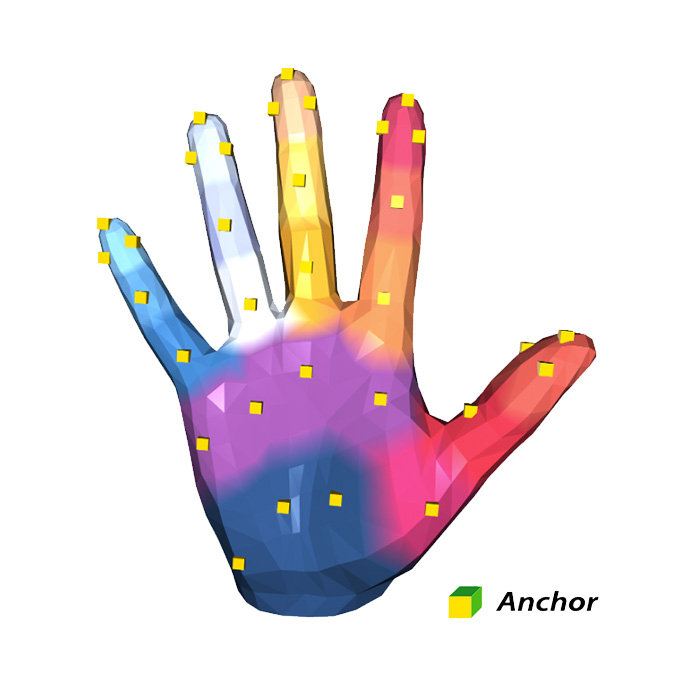
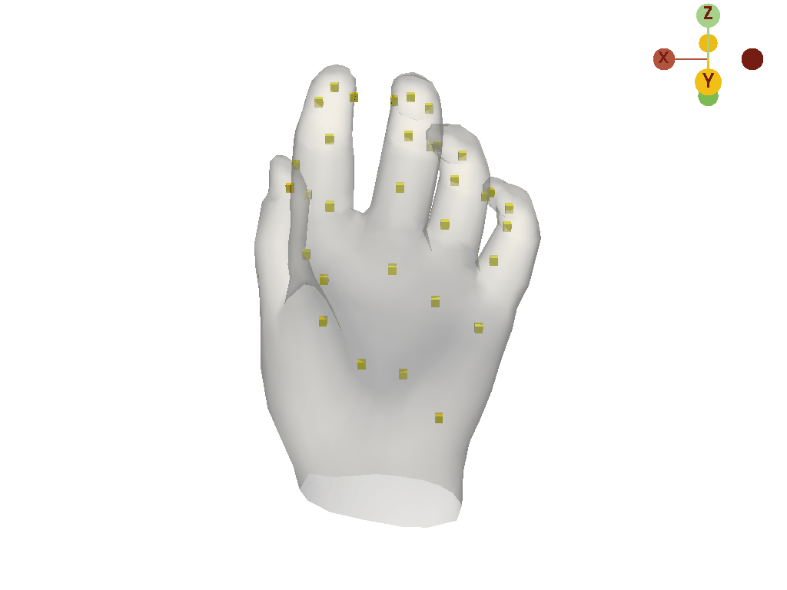

# manotorch: MANO Pytorch

**manotorch** is a differentiable PyTorch layer that deterministically maps from pose and shape parameters to hand joints and vertices.
It can be integrated into any architecture as a differentiable layer to predict hand mesh.

---

## :spiral_notepad: Introduction

This MANO layer is modified from the original [manopth](https://github.com/hassony2/manopth).  
It is compatible with Yana's [manopth](https://github.com/hassony2/manopth) and Omid's [MANO](https://github.com/otaheri/MANO).  
It has the following features:

### Anatomical Consistent Basis

The original MANO model is driven by a kinematic tree with 16 joints, where each joint’s rotation is represented in
the form of axis-angle. To represent the joint rotation in a three-dimensional
Euclidean space, we need to find an orthogonal basis (consists of three orthogonal axes) that describes the rotation.
Apparently, there have infinity choices of the orthogonal basis. For example, the original MANO model adopts the
same orthogonal basis as the wrist for all of its 16 joints.

We seek to find a basis whose three axes can describe three independent hand motions that satisfy the hand
anatomy. Therefore we can decompose the joint rotation w.r.t. this basis and penalize the abnormal
pose on that joint.

<p align="center">
    
</p>

### Anatomy Loss

In our ICCV2021 work [CPF](https://lixiny.github.io/CPF/), we penalize the abnormal poses by projecting the rotation axis of _axis-angle_ into three independent axes, and then penalize the abnormal axial components on that joint.
This is a effective heuristic to avoid the abnormal pose, but it is still not a perfect solution, since:

- First, the twist-spread-bend axes are calculated from the **posed** hand (vs unposed hand in its canonical pose).
  In this case, if the hand already has a largely abnormal pose, these three axes will be abnormal as well, resulting the anatomical loss in a meaningless way.
- Second, when the scalar angle of _axis-angle_ is close to zero, the rotation axis is not reliable to describe the rotation.

To overcome this, in the new manotorch,
we firstly use the **unposed** hand to calculate the twist-spread-bend axes in its canonical pose.
Later, we can transform these basis to the **posed** hand, based on the 16 $\mathbf{SE}(3)$ transformation matrices.

:eyes: See [manotorch/axislayer.py](manotorch/axislayer.py): `AxisLayerFK` for details (FK: forward kinematics).  
:runner: Run: [scripts/simple_app.py](scripts/simple_app.py)

```shell
python scripts/simple_app.py --mode axis
```

<p align="center">
    
</p>

To overcome the first issue,
For each joint rotation,
we decompose it in any pose into the rotations of the child frame in relation to the child's anatomical consistent basis
and the rotation of the the child's anatomical consistent basis in relation to the parent's predefined (MANO) coordinate basis.
The latter rotation is independent of the pose of hand and is thus solved only once, for the zero pose and mean shape, it can then be used as a fixed value (denoted as `TMPL_R_p_a` in the AxisLayerFK module).
Therefore, we only need to penalize the former rotation, which is more reliable. 
e.g supervise the rotation of the child frame in relation to the child's anatomical consistent basis to prevent abnormal twisting rotations (e.g., rotations around the `twist` (1,0,0) axis).

To overcome the second issue,
we penalize the rotation in form of the euler angles, which is more robust to the small angle.

:eyes: See [manotorch/anatomy_loss.py](manotorch/anatomy_loss.py): `AnatomyConstraintLossEE` for details (EE: euler angle).  
:runner: Run: [scripts/simple_anatomy_loss.py](scripts/simple_anatomy_loss.py) to show the pose correction.

```shell
python scripts/simple_anatomy_loss.py
```

<p align="center">
    
</p>

### Composing the Hand

Based on the Anatomical Consistent Basis, we can also compose the hand from a given euler angles.

:eyes: See: [manotorch/axislayer.py](manotorch/axislayer.py): `AxisLayerFK.compose` for details (FK: forward kinematics).  
:runner: Run: [scripts/simple_compose.py](scripts/simple_compose.py), It shows how we specify the euler angles of joint on the index finger and compose the hand in a deterministic way.

```shell
#   transform order of right hand
#         15-14-13-\
#                   \
#*   3-- 2 -- 1 -----0   < NOTE: demo on this finger
#   6 -- 5 -- 4 ----/
#   12 - 11 - 10 --/
#    9-- 8 -- 7 --/

#  the ID: 1 joints have been rotated by pi/6 around spread-axis, and pi/2 around bend-axis
#  the ID: 2, 3 joints have been rotated by pi/2 around bend-axis

python scripts/simple_compose.py
```

<p align="center">
    
</p>

### Anchor Interpolation

These anchors derive a coarse palm vertices representation to treat contact during hand-object interaction.

:eyes: See [manotorch/anchorlayer.py](manotorch/anchorlayer.py): `AnchorLayer` for details.  
:runner: Run: [scripts/simple_app.py](scripts/simple_app.py)

```shell
python scripts/simple_app.py --mode anchor
```

<p align="center">
    
    
</p>

:thumbsup: If you find the manotorch useful in your research,
please consider citing CPF,
where the manotorch is originally developed:

```
@inproceedings{yang2021cpf,
    title = {{CPF}: Learning a Contact Potential Field to Model the Hand-Object Interaction},
    author = {Yang, Lixin and Zhan, Xinyu and Li, Kailin and Xu, Wenqiang and Li, Jiefeng and Lu, Cewu},
    booktitle = {ICCV},
    year = {2021}
}
```

and the original MANO publication:

```

@article{MANO:SIGGRAPHASIA:2017,
    title = {Embodied Hands: Modeling and Capturing Hands and Bodies Together},
    author = {Romero, Javier and Tzionas, Dimitrios and Black, Michael J.},
    journal = {ACM Transactions on Graphics, (Proc. SIGGRAPH Asia)},
    publisher = {ACM},
    month = nov,
    year = {2017},
    url = {http://doi.acm.org/10.1145/3130800.3130883},
    month_numeric = {11}
}

```

---

## :rocket: Installation

### Get code and dependencies

```shell
$ git clone https://github.com/lixiny/manotorch.git
$ cd manotorch
```

Install the dependencies listed in [environment.yaml](environment.yaml)

```shell
# In a new environment,
$ conda env create -f environment.yaml

# Or in an existing conda environment,
$ conda env update -f environment.yaml
```

### Download MANO pickle data-structures

- Visit [MANO website](http://mano.is.tue.mpg.de/)
- Create an account by clicking _Sign Up_ and provide your information
- Download Models and Code (the downloaded file should have the format `mano_v*_*.zip`). Note that all code and data from this download falls under the [MANO license](http://mano.is.tue.mpg.de/license).
- unzip and copy the contents in `mano_v*_*/` folder to the `assets/mano/` folder
- Your `assets/mano` folder structure should look like this:

```
assets/mano
    ├── info.txt
    ├── __init__.py
    ├── LICENSE.txt
    ├── models
    │   ├── info.txt
    │   ├── LICENSE.txt
    │   ├── MANO_LEFT.pkl
    │   ├── MANO_RIGHT.pkl
    │   ├── SMPLH_female.pkl
    │   └── SMPLH_male.pkl
    └── webuser
        └── ...
```

### Optional: Install manotorch package

To be able to import and use manotorch in another project, go to your `manotorch` folder and run

```
$ pip install .
```

## :plate_with_cutlery: Usage

we provide a simple code snippet to demonstrate the minimal usage.

```python
import torch
from manotorch.manolayer import ManoLayer, MANOOutput

# Select number of principal components for pose space
ncomps = 15

# initialize layers
mano_layer = ManoLayer(use_pca=True, flat_hand_mean=False, ncomps=ncomps)

batch_size = 2
# Generate random shape parameters
random_shape = torch.rand(batch_size, 10)
# Generate random pose parameters, including 3 values for global axis-angle rotation
random_pose = torch.rand(batch_size, 3 + ncomps)

# The mano_layer's output contains:
"""
MANOOutput = namedtuple(
    "MANOOutput",
    [
        "verts",
        "joints",
        "center_idx",
        "center_joint",
        "full_poses",
        "betas",
        "transforms_abs",
    ],
)
"""
# forward mano layer
mano_output: MANOOutput = mano_layer(random_pose, random_shape)

# retrieve 778 vertices, 21 joints and 16 SE3 transforms of each articulation
verts = mano_output.verts  # (B, 778, 3), root(center_joint) relative
joints = mano_output.joints  # (B, 21, 3), root relative
transforms_abs = mano_output.transforms_abs  # (B, 16, 4, 4), root relative
```

### Advanced Usage

| [Visualize](scripts/simple_app.py) | [Simple Compose](scripts/simple_compose.py) | [Error Correction](scripts/simple_anatomy_loss.py) |
| :--------------------------------: | :-----------------------------------------: | :------------------------------------------------: |
|                   |                  |                        |
