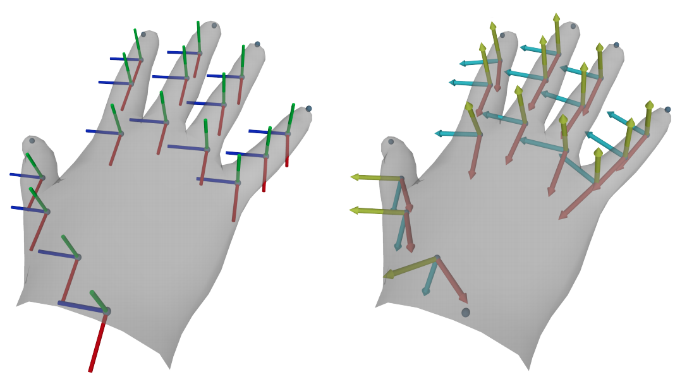
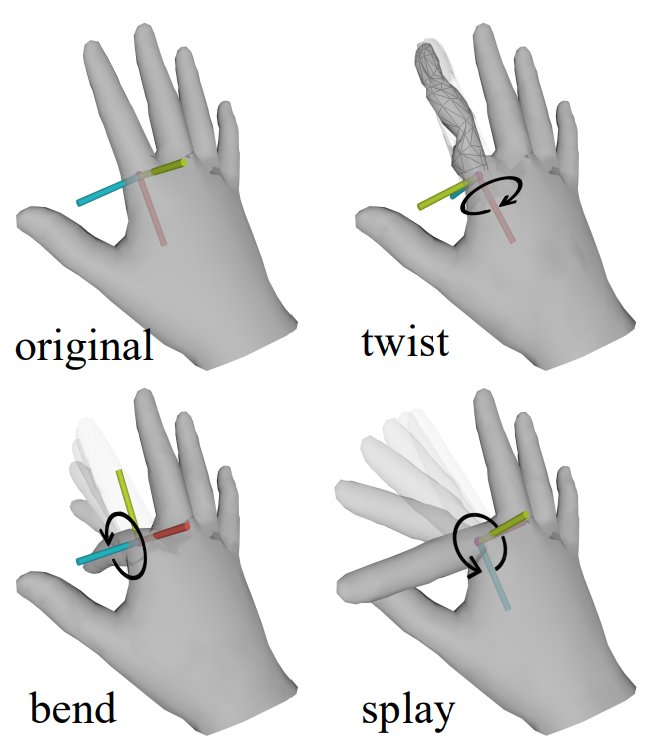
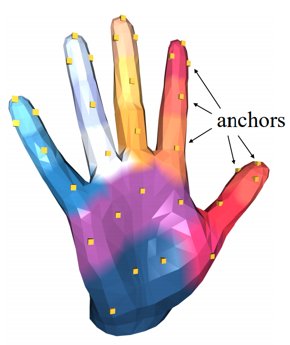
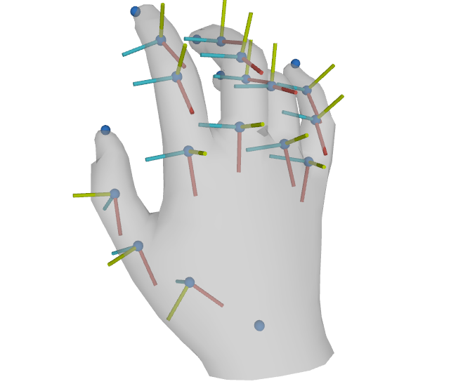
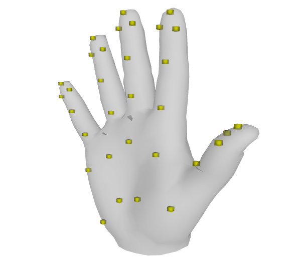

[MANO](http://mano.is.tue.mpg.de)  [pyTORCH](https://pytorch.org/)
=====
ManoLayer is a differentiable PyTorch layer that deterministically maps from pose and shape parameters to hand joints and vertices.
It can be integrated into any architecture as a differentiable layer to predict hand meshes.

---
# Introduction

This MANO layer is modified from the original [manopth](https://github.com/hassony2/manopth) with following features.
- [x] Additional axes adaptation to covert MANO's coordinate frame into a *twist-splay-bend*  frame based on hand anatomy ([axislayer.py](https://github.com/lixiny/manotorch/blob/master/manotorch/axislayer.py)).

<p align="center">
     
</p>
<p align="center">
    Left: original MANO coordinate system; Middle: axes adaptation;  Right: rotation based on the axes adaptation
</p>

- [x] Additional anchor interpolation to derive the anchor representation of MANO's vertices on palm ([anchorlayer](https://github.com/lixiny/manotorch/blob/master/manotorch/anchorlayer.py)).
<p align="center">
    
</p>

- [x] Quaternion rotation mode. ([quatutils.py](https://github.com/lixiny/manotorch/blob/master/manotorch/utils/quatutils.py))
- [ ] Ortho6D rotation mode.

- [ ] Employ [lietorch](https://github.com/princeton-vl/lietorch) to perform `exp()` in SO(3) group. (once lietorch supports backward of *ToMatrix* operation).


The first two features were developed and used for the paper *CPF: Learning a Contact Potential Field to Model the Hand-object Interaction*.
But we find it also useful in researches including:
* avoid hand pose abnormality during learning or fitting by applying anatomically constraints on rotation axes and angles.
* derive a coarse palm vertices representation to treat contact during hand-object interaction.


If you find this code useful for your research, consider citing:
- the publication of the repository was used for
```
@article{yang2020cpf,
  title={CPF: Learning a Contact Potential Field to Model the Hand-object Interaction},
  author={Yang, Lixin and Zhan, Xinyu and Li, Kailin and Xu, Wenqiang and Li, Jiefeng and Lu, Cewu},
  journal={arXiv preprint arXiv:2012.00924},
  year={2020}
}
```
- the original [MANO](http://mano.is.tue.mpg.de) publication:
```
@article{MANO:SIGGRAPHASIA:2017,
  title = {Embodied Hands: Modeling and Capturing Hands and Bodies Together},
  author = {Romero, Javier and Tzionas, Dimitrios and Black, Michael J.},
  journal = {ACM Transactions on Graphics, (Proc. SIGGRAPH Asia)},
  publisher = {ACM},
  month = nov,
  year = {2017},
  url = {http://doi.acm.org/10.1145/3130800.3130883},
  month_numeric = {11}
}
```
---
# Installation

## Get code and dependencies

``` shell
$ git clone https://github.com/lixiny/manotorch.git
$ cd manotorch
```
Install the dependencies listed in [environment.yaml](environment.yaml)

``` shell
# In a new environment,
$ conda env create -f environment.yaml

# Or in an existing conda environment,
$ conda env update -f environment.yaml
```

For user in China, we provide an alternative `environment_tuna.yaml` based on [Tuna Mirror](https://mirrors.tuna.tsinghua.edu.cn/) of Tsinghua University


## Download MANO pickle data-structures
- Visit [MANO website](http://mano.is.tue.mpg.de/)
- Create an account by clicking *Sign Up* and provide your information
- Download Models and Code (the downloaded file should have the format `mano_v*_*.zip`). Note that all code and data from this download falls under the [MANO license](http://mano.is.tue.mpg.de/license).
- unzip and copy the contents in `mano_v*_*/` folder to the `assets/mano/` folder
- Your `assets/mano` folder structure should look like this:
```
assets/mano
        ├── info.txt
        ├── __init__.py
        ├── LICENSE.txt
        ├── models
        │   ├── info.txt
        │   ├── LICENSE.txt
        │   ├── MANO_LEFT.pkl
        │   ├── MANO_RIGHT.pkl
        │   ├── SMPLH_female.pkl
        │   └── SMPLH_male.pkl
        └── webuser
            └── ...
```

## Optional: Install manotorch package
To be able to import and use manotorch in another project, go to your `manotorch` folder and run
```
$ pip install .
# Or,
$ pip install -e .
```

# Usage

we provide a simple code snippet to demonstrate the minimal usage.
``` python
import torch
from manotorch.manolayer import ManoLayer
from manotorch.axislayer import AxisLayer
from manotorch.anchorlayer import AnchorLayer

# Select number of principal components for pose space
ncomps = 15

# initialize layers
mano_layer = ManoLayer(use_pca=True, flat_hand_mean=False, ncomps=ncomps)
axis_layer = AxisLayer()
anchor_layer = AnchorLayer()

batch_size = 2
# Generate random shape parameters
random_shape = torch.rand(batch_size, 10)
# Generate random pose parameters, including 3 values for global axis-angle rotation
random_pose = torch.rand(batch_size, 3 + ncomps)


"""
MANOOutput = namedtuple(
    "MANOOutput",
    [
        "verts",
        "joints",
        "center_idx",
        "center_joint",
        "full_poses",
        "betas",
        "transforms_abs",
    ],
)
"""
# forward mano layer
mano_output = mano_layer(random_pose, random_shape)

# retrieve 778 vertices, 21 joints and 16 absolute transforms of each articulation
verts = mano_output.verts
joints = mano_output.joints
transforms_abs = mano_output.transforms_abs

# optional, forward anchor layer to retrieve anchors
anchors = anchor_layer(verts)

# optional, forward axis layer to retrieve twist-splay-bend (back-up-left) axes
bul_axes = axis_layer(joints, transforms_abs) # bul: back-up-left

```

# Visualize
We provide a visualization code in `app.py`.
It will draw the hand mesh, joints, *twist-splay-bend* axes and anchors in PyRender (require active screen)

<p align="center">
      
</p>
